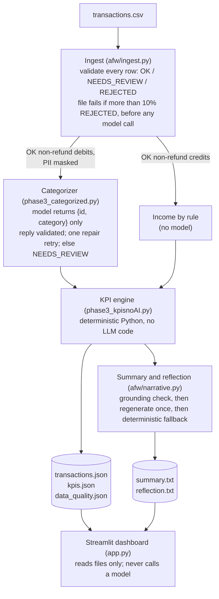

# AgenticFinancialWorkflow

[](https://github.com/Jeffrie-04/AgenticFinancialWorkflowV2/actions/workflows/ci.yml)

A pipeline that turns a small business's bank-transaction CSV into categorized spending, financial KPIs, and a plain-English summary and advice.

## The problem

Small-business owners get their finances as raw bank CSVs: hundreds of rows of merchants and amounts, with no picture of where the money went. This pipeline validates each row, categorizes the purchases, computes KPIs (net cash flow, spend by category, income concentration, fixed vs. discretionary costs, burn rate), and writes a short summary and an advisor reflection. A Streamlit dashboard shows the results for each business.

## The core design: AI for language, Python for math

The model does two things only: it picks a category for each purchase, and it writes the summary and advice text. Every money figure is computed in Python from validated source data. Amounts, dates and merchants never come from model output, and every number the model writes must match a computed KPI, or the text is rejected.

## Architecture



`run.py` runs the phases in order and exits 1 if any phase fails. A short planning step (`phase2_plan.py`) also runs after ingest; its output is informational only. Refunds take the category of their original debit and are never sent to the model. `data_quality.json` records row counts by status and reason, the KPI join report and the grounding outcomes. The dashboard reads the transactions, KPIs, summary and reflection, but not `data_quality.json`.

## What makes it trustworthy

- **Input validation:** every non-blank CSV row gets a status and, if it isn't OK, a reason; no row is silently dropped. Amounts are stored as positive values with a debit or credit direction, never as signed numbers. See [afw/ingest.py](afw/ingest.py), [afw/models.py](afw/models.py) and [ADR 0001](docs/adr/0001-debit-credit-direction.md).
- **Model output validation:** the categorizer's reply is schema-checked against the `Category` enum and the ids that were sent. A failure gets one repair retry, then the rows go to NEEDS_REVIEW; nothing is guessed. Credits are Income by rule, not by the model. See [afw/guards/output_validation.py](afw/guards/output_validation.py) and [ADR 0003](docs/adr/0003-credits-income-by-rule.md).
- **PII masking:** emails, phone numbers, and card and account numbers are masked in merchant and description text before it goes into a prompt. Person names are not masked, and local files keep the original text. See [afw/guards/pii.py](afw/guards/pii.py) and [ADR 0002](docs/adr/0002-pii-masking-scope.md).
- **Grounding:** each number in the summary and reflection must be a KPI value at the precision shown, and derived numbers fail. Failed text is regenerated once, then replaced by a deterministic fallback. See [afw/guards/grounding.py](afw/guards/grounding.py) and [afw/narrative.py](afw/narrative.py).
- **Eval:** 142 hand-labeled purchases from the four demo businesses score each categorizer prompt version. Replies are cached so results replay exactly. See [eval/](eval/), [eval/RESULTS.md](eval/RESULTS.md) and [ADR 0004](docs/adr/0004-travel-transportation-category.md).
- **Retries and CI:** temporary API errors (rate limits, overloaded, 5xx, timeouts) get up to 3 retries with backoff and at most 30s of waiting; permanent errors fail at once. Every push runs ruff, mypy, the tests and an offline eval replay with no API keys, and the tests run with the network blocked. See [afw/retry.py](afw/retry.py), [bedrock_client.py](bedrock_client.py), [.github/workflows/ci.yml](.github/workflows/ci.yml) and [tests/conftest.py](tests/conftest.py).

## Results

**Categorizer eval** ([eval/RESULTS.md](eval/RESULTS.md)): 142 labeled purchases, Claude Haiku 4.5 through the Anthropic API. v2 adds a Travel/Transportation category (v1 would put those rows in Other).

| Metric | v1 | v2 |
|---|---|---|
| Accuracy, original labels (blind) | 81.7% | 82.4% |
| Accuracy after the label audit (not blind) | 95.1% | 95.8% |
| Travel/Transportation precision | — | 100.0% |
| Travel/Transportation recall | — | 97.3% |
| Rows sent to review | 0 | 0 |

The first scoring surfaced gold labels that contradicted the prompts' own category definitions (for example, payroll labeled Other when the Utilities definition lists payroll). 19 labels were corrected by rule across four classes, and both versions were re-scored from the same cached replies. The audit followed the first results, so the audited scores aren't a blind measurement. The original-label scores are kept for that reason. The audit is documented in full in RESULTS.md. Each version is a single cached run; a fresh run against the model could differ.

**Grounding in the committed demo outputs:** 8 narratives in total (4 businesses, a summary and a reflection each). 6 passed the grounding check on the first try, 1 passed after one regeneration, and 1 fell back to the deterministic text. The fallback was the restaurant reflection, which used "97.2%", a number that isn't a KPI value. Outcomes are recorded in each `businesses/<name>/outputs/data_quality.json`.

## Quick start

Requires Python 3.12.

```bash
git clone https://github.com/Jeffrie-04/AgenticFinancialWorkflowV2.git
cd AgenticFinancialWorkflowV2
python3.12 -m venv venv
./venv/bin/pip install -r requirements.txt -r requirements-dev.txt
```

Create `.env` with one provider (it is git-ignored):

```bash
MODEL_PROVIDER=anthropic_direct
ANTHROPIC_API_KEY=your-key
```

`MODEL_PROVIDER` also accepts `openai` (the default; an OpenAI-compatible endpoint set by `OPENAI_API_KEY` and `OPENAI_BASE_URL`) or `claude` (Claude Haiku 4.5 on AWS Bedrock, using your AWS credentials). See [bedrock_client.py](bedrock_client.py).

```bash
# Run the pipeline for one business (calls the model; overwrites its outputs/)
./venv/bin/python run.py --business-dir businesses/restaurant

# Open the dashboard (reads the committed outputs; no model calls)
./venv/bin/streamlit run app.py

# Replay the eval offline from the committed cache (no model calls)
./venv/bin/python eval/run_eval.py --version v1 --offline
./venv/bin/python eval/run_eval.py --version v2 --offline
./venv/bin/python eval/run_eval.py --compare

# Run the tests, lint and type checks
./venv/bin/python -m pytest -q
./venv/bin/ruff check . && ./venv/bin/mypy afw
```

### CI

Every push and pull request runs `ruff check .`, `mypy afw` and `pytest -q` in GitHub Actions ([ci.yml](.github/workflows/ci.yml), Python 3.12). It then replays the eval offline and fails if `eval/RESULTS.md` or `eval/results/` would change. CI has no secrets and never calls a model: the eval replays from the committed cache in `eval/cache/`, and `--offline` stops on any cache miss.

To refresh the eval after a prompt, gold-set or model change, run it without `--offline`, which calls the model. Then commit the new `eval/cache/`, `eval/results/` and `eval/RESULTS.md`:

```bash
./venv/bin/python eval/run_eval.py --version v1
./venv/bin/python eval/run_eval.py --version v2
./venv/bin/python eval/run_eval.py --compare
```

## Project structure

```
afw/                     core library (typed, checked by mypy)
  ingest.py              CSV validation: status and reason per row
  models.py              Transaction, Status, Direction, the Category enum
  llm_input.py           the only way rows reach a prompt (OK rows, masked)
  narrative.py           grounded summary/reflection with regenerate and fallback
  retry.py               retry policy for model calls
  guards/                PII masking, model-output validation, grounding check
run.py                   runs every phase in order; exits 1 on failure
phase2_plan.py           planning step (informational)
phase3_categorized.py    categorizer
phase3_kpisnoAI.py       KPI engine (never imports model code)
phase3_summary.py        summary text
phase3_reflection.py     advisor reflection text
bedrock_client.py        call_model(): provider selection, error classification
app.py                   Streamlit dashboard
prompts/                 categorizer prompt versions (v1, v2)
businesses/<name>/       demo data: transactions.csv and committed outputs/
eval/                    gold set, eval harness, cached replies, results
docs/adr/                architecture decision records
tests/                   pytest suite; conftest.py blocks network and API keys
```

## Decision records

- [ADR 0001](docs/adr/0001-debit-credit-direction.md): positive amount plus direction instead of signed amounts.
- [ADR 0002](docs/adr/0002-pii-masking-scope.md): what gets masked in model prompts, and what doesn't.
- [ADR 0003](docs/adr/0003-credits-income-by-rule.md): credits are Income by rule, not by the model.
- [ADR 0004](docs/adr/0004-travel-transportation-category.md): adding the Travel/Transportation category.

## How this was built

This started as a team class project. This repository is my individual continuation of it. Each phase started with a written problem statement and a "done when". Claude Code planned and implemented each phase in small, test-first commits, and Codex reviewed independently ([AGENTS.md](AGENTS.md)). I made the decisions. AI decisions are logged in [docs/ai-log.md](docs/ai-log.md).

## Known limitations

- The analysis covers a single time period: there's no trend or period-over-period detection yet.
- Runway can't be computed without a starting cash balance, which a transaction CSV doesn't contain.
- The demo data is small (four businesses), and so is the gold set (142 purchases).
- Input is a clean CSV, not the bank or credit-card statements a business actually has.
- Categories are the same for every business, so a cost that means different things in different businesses (such as food supplies for a restaurant) can't be categorized differently.

## Future work

- **Per-business category rules:** let each business map its own recurring merchants to categories.
- **Rules-first categorization:** assign known merchants by rule, and send only the rest to the model.
- **Checkpoints:** save progress after each phase so a failed run resumes instead of starting over.
- **Compute the numbers the model wants in code:** when the model reaches for a derived figure (like the restaurant reflection's "97.2%"), compute that figure in the KPI engine so the text can cite it.
- **Statement ingestion and multi-month data:** parse real bank and credit-card statements, and support trend metrics across periods.
